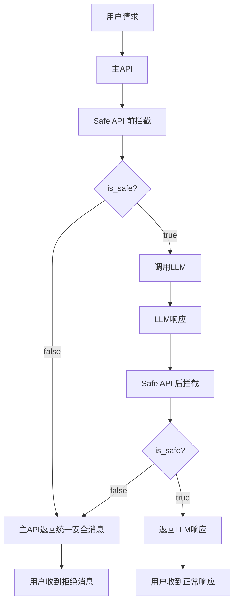

# 安全响应消息架构设计

## 🏗️ 架构原则

### 职责分离
- **Safe API**: 只负责拦截判断，返回 `is_safe`、`reason`、`score` 等技术信息
- **主 API**: 负责业务逻辑和用户交互，统一管理安全响应消息

### 设计理念
```
Safe API (判断层)  →  主 API (响应层)  →  用户
     ↓                    ↓                ↓
  is_safe: false    统一安全响应消息      拒绝话术
  reason: "..."     settings.safety_    "根据相关法律..."
  score: 0.95       response_message
```

## 🔧 实现详情

### Safe API 返回格式
```json
{
  "is_safe": false,
  "reason": "匹配到高敏感关键词",
  "matched_keywords": ["敏感词1", "敏感词2"],
  "score": 0.95,
  "safety_response": null  // 不返回具体消息
}
```

### 主 API 处理逻辑
```python
# 前拦截处理
if not intercept_result.is_safe:
    # 使用统一的安全响应消息
    safety_response_dict = await create_safety_response(
        "内容安全拦截", 
        settings.safety_response_message  # 统一配置
    )
    return safety_response_dict

# 后拦截处理
if not post_intercept_result.is_safe:
    # 使用统一的安全响应消息
    safety_response_dict = await create_safety_response(
        "内容安全拦截", 
        settings.safety_response_message  # 统一配置
    )
    return safety_response_dict
```

## 🎯 配置管理

### 环境变量（仅主API需要）
```bash
# 主API配置
export SAFETY_RESPONSE_MESSAGE="您的自定义安全响应消息"
```

### 配置文件 (config.py)
```python
class Settings(BaseSettings):
    # 统一安全响应消息配置
    safety_response_message: str = os.getenv(
        "SAFETY_RESPONSE_MESSAGE", 
        "根据相关法律法规以及道德伦理规范，我无法提供关于这个问题的回答，建议换一个话题。"
    )
```

## 📊 数据流图



## ✅ 优势

### 1. 职责清晰
- Safe API 专注于技术判断
- 主 API 专注于业务逻辑

### 2. 配置简化
- 只需在主 API 配置一次
- Safe API 无需关心具体消息内容

### 3. 维护性好
- 修改安全消息只需改主 API
- Safe API 可独立升级判断逻辑

### 4. 扩展性强
- 可根据拦截原因返回不同消息
- 支持多语言、个性化响应

## 🔄 迁移说明

### 从旧架构迁移
1. **Safe API 改动**:
   - 移除 `safety_response` 字段的具体内容
   - 返回 `safety_response: null`

2. **主 API 改动**:
   - 统一使用 `settings.safety_response_message`
   - 不再依赖 Safe API 返回的消息

3. **配置改动**:
   - Safe API 启动脚本移除 `SAFETY_RESPONSE_MESSAGE`
   - 主 API 启动脚本保留 `SAFETY_RESPONSE_MESSAGE`

## 🧪 测试验证

### 测试步骤
1. 设置自定义安全响应消息
2. 启动 Safe API（不需要设置消息）
3. 启动主 API（设置消息）
4. 发送敏感内容测试
5. 验证返回的是主 API 设置的消息

### 测试脚本
```bash
# 设置自定义消息
export SAFETY_RESPONSE_MESSAGE="这是测试消息"

# 启动服务
./start_safe_api.sh    # 不会使用这个环境变量
./start_main_api.sh    # 会使用这个环境变量

# 测试
curl -X POST "http://localhost:8080/v1/chat/completions" \
  -H "Content-Type: application/json" \
  -d '{"model": "test", "messages": [{"role": "user", "content": "敏感内容"}]}'
```

## 📝 注意事项

1. **Safe API 重启**: 修改安全消息不需要重启 Safe API
2. **主 API 重启**: 修改安全消息需要重启主 API
3. **向后兼容**: 旧的 Safe API 返回消息会被主 API 忽略
4. **错误处理**: Safe API 异常时，主 API 使用统一消息

## 🔗 相关文件

- `config.py` - 统一配置管理
- `main.py` - 主 API 业务逻辑
- `safe_api_client.py` - Safe API 客户端
- `safe_api/front_intercept_api.py` - 前拦截服务
- `safe_api/post_intercept_api.py` - 后拦截服务
